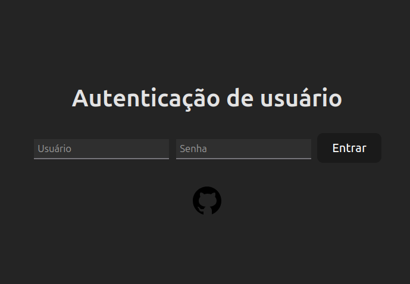

### **EssayCorrectorMVP**

An MVP for an essay correction platform designed for Brazilian Portuguese texts. This project aims to automate the detection and suggestion of corrections for researchers, leveraging a pre-existing corpus of texts with their grades. This platform is aimed towards making gold standard error-tagging more user-friendly and faster.

#### **Key Features**:
- **Corpus Integration**: Works with a pre-existing dataset of graded essays with correction candidates for each unknown token.
- **User-Friendly Interface**: A responsive web interface built with **React** for seamless user interaction.
- **Backend API**: Powered by **Flask** for handling requests and processing corrections.
- **Database**: Utilizes **Postgres** for storing essays, grades, and correction data.
- **Deployment**: Containerized with **Docker** and served via **Nginx** for scalability and ease of deployment.

#### **Tech Stack**:
- **Frontend**: React
- **Backend**: Flask
- **Database**: Postgres
- **DevOps**: Docker, Nginx

#### **Use Case**:
This platform is designed for researchers and educators working with Brazilian Portuguese texts, providing an efficient way to analyze and improve written content.


_User authentication page_


_Main application page_

---

### **How to Use**:
1. Clone the repository.
2. Set up the environment using Docker:
   ```bash
   docker-compose up --build
   ```
3. Access the platform at `http://localhost:8081`.

---

### **Contributing**:
Contributions are welcome! Please open an issue or submit a pull request for any improvements or bug fixes.

---

### **License**:
This project is licensed under the MIT License. See the [LICENSE](LICENSE) file for details.

---

This description is concise, highlights the key features, and provides clear instructions for setup and contribution. Let me know if you'd like to tweak it further! 🚀
